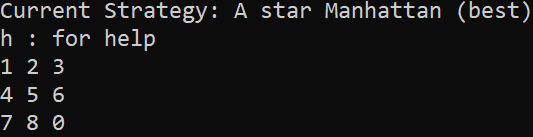

# 8-Puzzle



# FAQ
* [What is 8-Puzzle?](https://en.wikipedia.org/wiki/Sliding_puzzle)(Ctrl + click) the link
    - It's like the 15 puzzle, also known as 'Sliding puzzle'
* Does this work on Linux?
    - Sadly no, due to libraries used in the code.
* Does this work on Windows
    - Yes, below instructions are provided.

# Install for windows
1. Download zip to Downloads
2. Unzip 8-Puzzle-master
    * right-click & **extract here**
3. [gcc/g++ Compilers (used to compile and play)](https://iweb.dl.sourceforge.net/project/tdm-gcc/TDM-GCC%20Installer/tdm64-gcc-5.1.0-2.exe)(Ctrl + click) the link
    * run & install
    * Video on how to install the compilers [Compiler Installation Tutorial](https://youtu.be/w23QyVb1Jx4)(Ctrl + click) the link
    * If you have installed them once, you don't need to again
4. Press together: ```Win + R```
5. type & enter: ```cmd```
6. type & enter: ```cd Downloads``` to **c**hange **d**irectory to your Downloads
7. type & enter: ```cd 8-Puzzle-master```
8. type & enter: ```g++ -std=c++11 main.cpp -O3 -o run```
9. Read ```How to play``` before playing
10. type & enter: ```run```

# How to play  
1. **Movement**:
    * w : (Up)    Swap '0' with the # above
    * s : (Down)  Swap '0' with the # below
    * a : (Left)  Swap '0' with the # left
    * d : (Right) Swap '0' with the # right
2. **Options**
    * 0 : Quit
    * **Path finding strategies:**
        - 1 : Uniform Cost Search          (worst)
        - 2 : Misplaced Tile Heuristic     (better)
        - 3 : Manhattan Distance Heuristic (best)
    * z : Show real-time shortest solution
        - Based on path finding strategy used
    * x : Input custom 3x3 board
    * m : Mix puzzle with _ random moves (1 - too many)
        - Can press any key to skip watching/waiting for mix to finish
    * S : Solve
    * R : Reset board to solved state
    * G : Set 1 of 2 hardest possible puzzle states for 8 puzzle
    * ? : Change puzzle size
    * h : Show this help menu